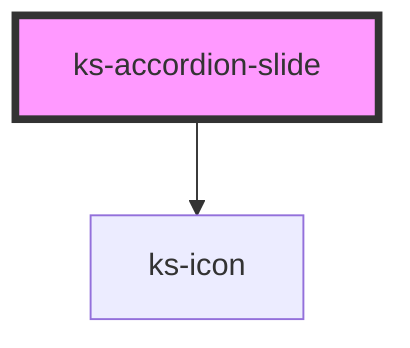

# ks-alert

<!-- Auto Generated Below -->

## Properties

| Property   | Attribute  | Description | Type      | Default     |
| ---------- | ---------- | ----------- | --------- | ----------- |
| `expanded` | `expanded` |             | `boolean` | `false`     |
| `heading`  | `heading`  |             | `string`  | `undefined` |

## Methods

### `toggleSlide() => Promise<void>`

#### Returns

Type: `Promise<void>`

## Dependencies

### Depends on

- [ks-icon](../icon)

### Graph

----------------------------------------------

*Built with [StencilJS](https://stenciljs.com/)*
