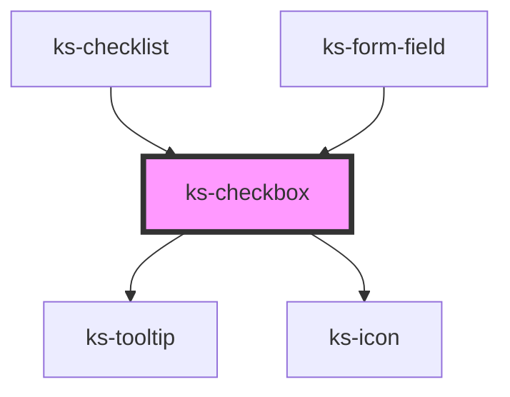

# ks-checkbox

<!-- Auto Generated Below -->

## Properties

| Property        | Attribute       | Description | Type                           | Default      |
| --------------- | --------------- | ----------- | ------------------------------ | ------------ |
| `checked`       | `checked`       |             | `boolean`                      | `false`      |
| `disabled`      | `disabled`      |             | `boolean`                      | `false`      |
| `indeterminate` | `indeterminate` |             | `boolean`                      | `false`      |
| `label`         | `label`         |             | `string`                       | `undefined`  |
| `name`          | `name`          |             | `string`                       | `undefined`  |
| `required`      | `required`      |             | `boolean`                      | `undefined`  |
| `requiredText`  | `required-text` |             | `string`                       | `'Required'` |
| `tooltipLabel`  | `tooltip-label` |             | `string`                       | `undefined`  |
| `tooltipSize`   | `tooltip-size`  |             | `"lg" \| "md" \| "sm" \| "xl"` | `'sm'`       |
| `tooltipText`   | `tooltip-text`  |             | `string`                       | `undefined`  |

## Events

| Event     | Description | Type                          |
| --------- | ----------- | ----------------------------- |
| `changed` |             | `CustomEvent<IFormFieldData>` |

## Methods

### `validate() => Promise<IFormFieldData>`

#### Returns

Type: `Promise<IFormFieldData>`

## Dependencies

### Used by

 - [ks-checklist](../checklist)
 - [ks-form-field](..)

### Depends on

- [ks-tooltip](../../tooltip)
- [ks-icon](../../icon)

### Graph

----------------------------------------------

*Built with [StencilJS](https://stenciljs.com/)*
