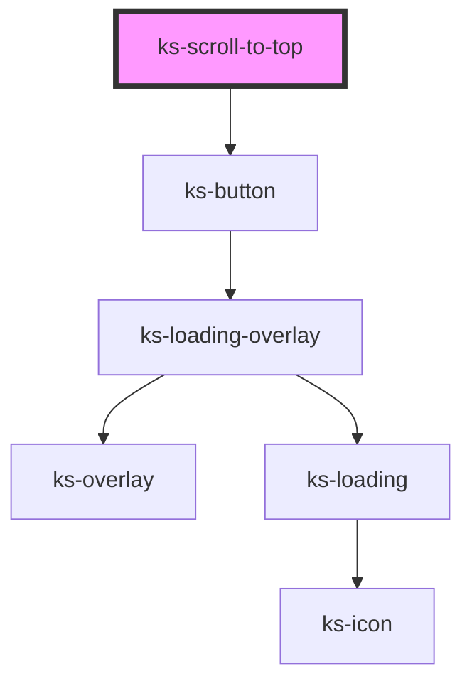

# ks-badge

<!-- Auto Generated Below -->

## Properties

| Property    | Attribute   | Description | Type                                                                                            | Default     |
| ----------- | ----------- | ----------- | ----------------------------------------------------------------------------------------------- | ----------- |
| `color`     | `color`     |             | `"danger" \| "dark" \| "info" \| "light" \| "primary" \| "secondary" \| "success" \| "warning"` | `'primary'` |
| `display`   | `display`   |             | `"clear" \| "hollow" \| "link" \| "solid"`                                                      | `'solid'`   |
| `size`      | `size`      |             | `"lg" \| "md" \| "sm" \| "xl" \| "xs"`                                                          | `'md'`      |
| `threshold` | `threshold` |             | `number`                                                                                        | `100`       |

## Dependencies

### Depends on

- [ks-button](../button)

### Graph

----------------------------------------------

*Built with [StencilJS](https://stenciljs.com/)*
