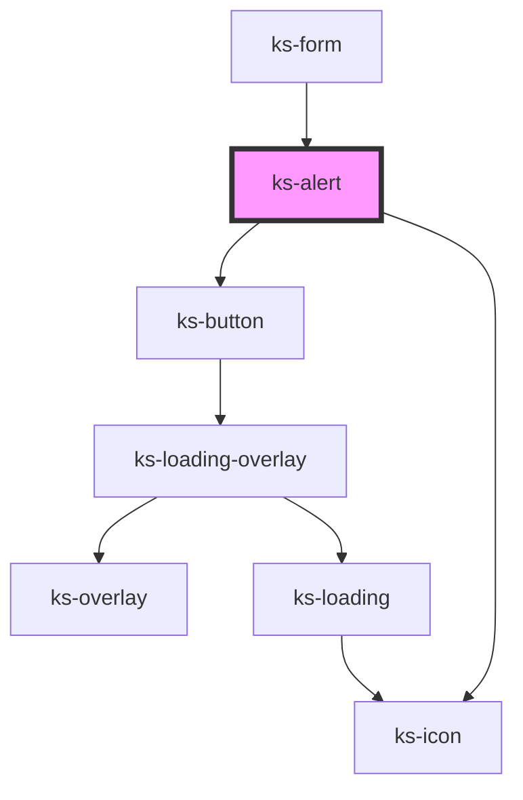

# ks-alert

<!-- Auto Generated Below -->

## Properties

| Property      | Attribute     | Description | Type                                                                                            | Default     |
| ------------- | ------------- | ----------- | ----------------------------------------------------------------------------------------------- | ----------- |
| `closeText`   | `close-text`  |             | `string`                                                                                        | `'Close'`   |
| `color`       | `color`       |             | `"danger" \| "dark" \| "info" \| "light" \| "primary" \| "secondary" \| "success" \| "warning"` | `'primary'` |
| `dismissible` | `dismissible` |             | `boolean`                                                                                       | `false`     |
| `display`     | `display`     |             | `boolean`                                                                                       | `false`     |
| `header`      | `header`      |             | `string`                                                                                        | `undefined` |
| `note`        | `note`        |             | `boolean`                                                                                       | `false`     |

## Events

| Event    | Description | Type               |
| -------- | ----------- | ------------------ |
| `hidden` |             | `CustomEvent<any>` |
| `shown`  |             | `CustomEvent<any>` |

## Methods

### `hide() => Promise<void>`

#### Returns

Type: `Promise<void>`

### `show() => Promise<void>`

#### Returns

Type: `Promise<void>`

## Dependencies

### Used by

 - [ks-form](../form)

### Depends on

- [ks-button](../button)
- [ks-icon](../icon)

### Graph

----------------------------------------------

*Built with [StencilJS](https://stenciljs.com/)*
