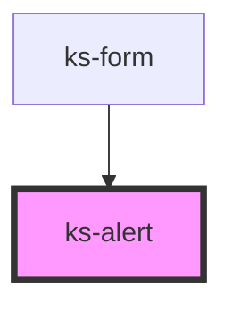

# ks-alert

<!-- Auto Generated Below -->

## Properties

| Property | Attribute | Description | Type                                                                                            | Default     |
| -------- | --------- | ----------- | ----------------------------------------------------------------------------------------------- | ----------- |
| `color`  | `color`   |             | `"danger" \| "dark" \| "info" \| "light" \| "primary" \| "secondary" \| "success" \| "warning"` | `'primary'` |
| `header` | `header`  |             | `string`                                                                                        | `undefined` |
| `note`   | `note`    |             | `boolean`                                                                                       | `false`     |

## Dependencies

### Used by

 - [ks-form](../form)

### Graph

----------------------------------------------

*Built with [StencilJS](https://stenciljs.com/)*
