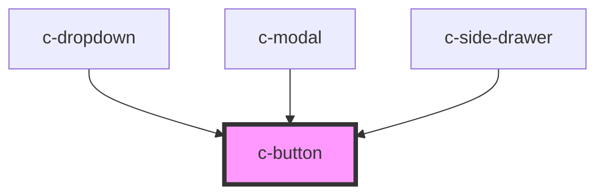

# c-button

<!-- Auto Generated Below -->

## Properties

| Property        | Attribute        | Description | Type                                                                                                      | Default     |
| --------------- | ---------------- | ----------- | --------------------------------------------------------------------------------------------------------- | ----------- |
| `clear`         | `clear`          |             | `boolean`                                                                                                 | `undefined` |
| `controls`      | `controls`       |             | `string`                                                                                                  | `undefined` |
| `cssClass`      | `css-class`      |             | `string`                                                                                                  | `''`        |
| `expanded`      | `expanded`       |             | `boolean`                                                                                                 | `undefined` |
| `haspopup`      | `haspopup`       |             | `boolean`                                                                                                 | `undefined` |
| `hideText`      | `hide-text`      |             | `boolean`                                                                                                 | `false`     |
| `hollow`        | `hollow`         |             | `boolean`                                                                                                 | `undefined` |
| `href`          | `href`           |             | `string`                                                                                                  | `undefined` |
| `icon`          | `icon`           |             | `string`                                                                                                  | `''`        |
| `iconDirection` | `icon-direction` |             | `"left" \| "right"`                                                                                       | `'left'`    |
| `size`          | `size`           |             | `"large" \| "medium" \| "small" \| "xlarge" \| "xsmall"`                                                  | `'medium'`  |
| `type`          | `type`           |             | `"danger" \| "dark" \| "info" \| "light" \| "link" \| "primary" \| "secondary" \| "success" \| "warning"` | `'primary'` |

## Dependencies

### Used by

 - [c-dropdown](../dropdown)
 - [c-modal](../modal)
 - [c-side-drawer](../side-drawer)

### Graph

----------------------------------------------

*Built with [StencilJS](https://stenciljs.com/)*
