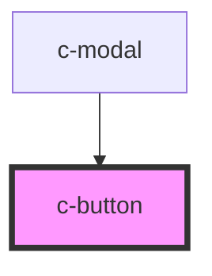

# c-button

<!-- Auto Generated Below -->

## Properties

| Property        | Attribute        | Description | Type       | Default     |
| --------------- | ---------------- | ----------- | ---------- | ----------- |
| `clear`         | `clear`          |             | `boolean`  | `undefined` |
| `clickHandler`  | --               |             | `Function` | `undefined` |
| `cssClass`      | `css-class`      |             | `string`   | `''`        |
| `hollow`        | `hollow`         |             | `boolean`  | `undefined` |
| `href`          | `href`           |             | `string`   | `undefined` |
| `icon`          | `icon`           |             | `string`   | `undefined` |
| `iconDirection` | `icon-direction` |             | `string`   | `'left'`    |
| `size`          | `size`           |             | `string`   | `undefined` |
| `type`          | `type`           |             | `string`   | `'primary'` |

## Dependencies

### Used by

 - [c-modal](../modal)

### Graph

----------------------------------------------

*Built with [StencilJS](https://stenciljs.com/)*
