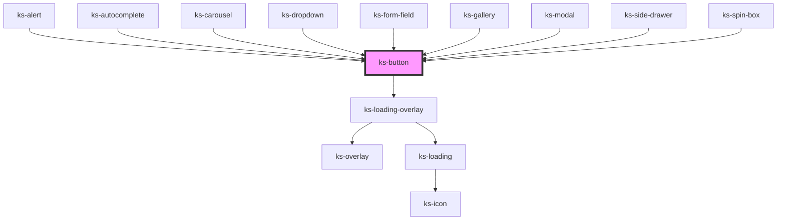

# ks-button

<!-- Auto Generated Below -->

## Properties

| Property      | Attribute      | Description | Type                                                                                            | Default     |
| ------------- | -------------- | ----------- | ----------------------------------------------------------------------------------------------- | ----------- |
| `buttonClass` | `button-class` |             | `string`                                                                                        | `''`        |
| `color`       | `color`        |             | `"danger" \| "dark" \| "info" \| "light" \| "primary" \| "secondary" \| "success" \| "warning"` | `'primary'` |
| `controls`    | `controls`     |             | `string`                                                                                        | `undefined` |
| `cssClass`    | `css-class`    |             | `string`                                                                                        | `''`        |
| `describedBy` | `described-by` |             | `string`                                                                                        | `undefined` |
| `disabled`    | `disabled`     |             | `boolean`                                                                                       | `undefined` |
| `display`     | `display`      |             | `"clear" \| "hollow" \| "link" \| "solid"`                                                      | `'solid'`   |
| `download`    | `download`     |             | `boolean`                                                                                       | `undefined` |
| `expanded`    | `expanded`     |             | `boolean`                                                                                       | `false`     |
| `haspopup`    | `haspopup`     |             | `boolean`                                                                                       | `false`     |
| `hides`       | `hides`        |             | `string`                                                                                        | `undefined` |
| `href`        | `href`         |             | `string`                                                                                        | `undefined` |
| `hrefProp`    | `href-prop`    |             | `string`                                                                                        | `'href'`    |
| `linkTag`     | `link-tag`     |             | `string`                                                                                        | `'a'`       |
| `loading`     | `loading`      |             | `boolean`                                                                                       | `undefined` |
| `shows`       | `shows`        |             | `string`                                                                                        | `undefined` |
| `size`        | `size`         |             | `"lg" \| "md" \| "sm" \| "xl" \| "xs"`                                                          | `'md'`      |
| `tabIndex`    | `tab-index`    |             | `number`                                                                                        | `undefined` |
| `target`      | `target`       |             | `string`                                                                                        | `undefined` |
| `type`        | `type`         |             | `"button" \| "reset" \| "submit"`                                                               | `'button'`  |

## Dependencies

### Used by

 - [ks-alert](../alert)
 - [ks-autocomplete](../form-field/autocomplete)
 - [ks-carousel](../carousel)
 - [ks-dropdown](../dropdown)
 - [ks-form-field](../form-field)
 - [ks-gallery](../gallery)
 - [ks-modal](../modal)
 - [ks-side-drawer](../side-drawer)
 - [ks-spin-box](../form-field/spin-box)

### Depends on

- [ks-loading-overlay](../loading)

### Graph

----------------------------------------------

*Built with [StencilJS](https://stenciljs.com/)*
