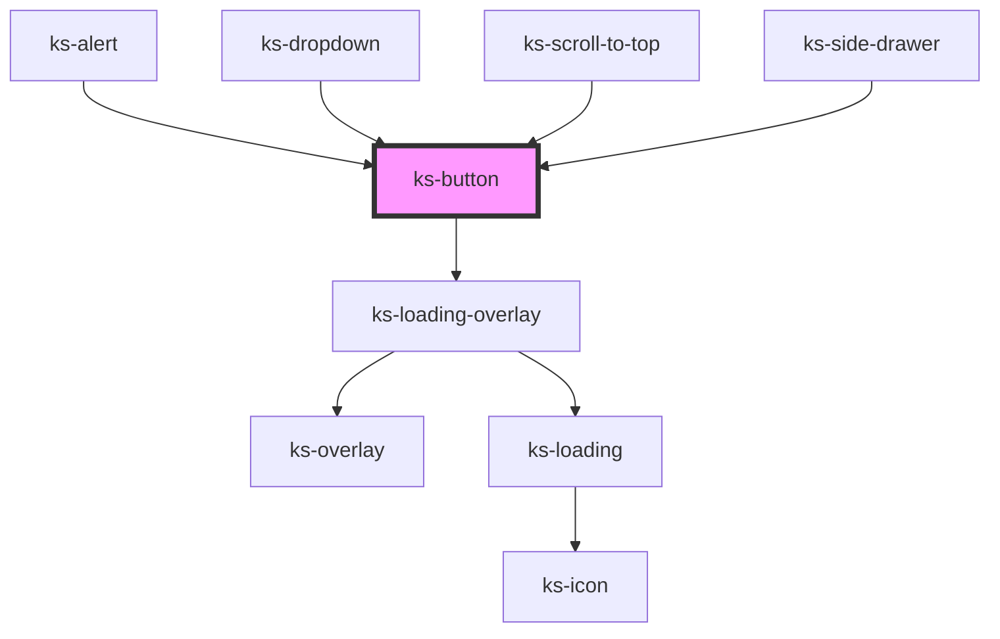

# ks-button

<!-- Auto Generated Below -->

## Properties

| Property             | Attribute              | Description | Type                                                                                                                  | Default        |
| -------------------- | ---------------------- | ----------- | --------------------------------------------------------------------------------------------------------------------- | -------------- |
| `buttonClass`        | `button-class`         |             | `string`                                                                                                              | `''`           |
| `color`              | `color`                |             | `"black" \| "danger" \| "dark" \| "info" \| "light" \| "primary" \| "secondary" \| "success" \| "warning" \| "white"` | `'primary'`    |
| `controls`           | `controls`             |             | `string`                                                                                                              | `undefined`    |
| `describedBy`        | `described-by`         |             | `string`                                                                                                              | `undefined`    |
| `disabled`           | `disabled`             |             | `boolean`                                                                                                             | `undefined`    |
| `display`            | `display`              |             | `"clear" \| "hollow" \| "link" \| "solid"`                                                                            | `'solid'`      |
| `download`           | `download`             |             | `boolean`                                                                                                             | `undefined`    |
| `expanded`           | `expanded`             |             | `boolean`                                                                                                             | `false`        |
| `haspopup`           | `haspopup`             |             | `boolean`                                                                                                             | `false`        |
| `hides`              | `hides`                |             | `string`                                                                                                              | `undefined`    |
| `href`               | `href`                 |             | `string`                                                                                                              | `undefined`    |
| `hrefProp`           | `href-prop`            |             | `string`                                                                                                              | `'href'`       |
| `linkTag`            | `link-tag`             |             | `string`                                                                                                              | `'a'`          |
| `loading`            | `loading`              |             | `boolean`                                                                                                             | `undefined`    |
| `loadingIcon`        | `loading-icon`         |             | `string`                                                                                                              | `undefined`    |
| `loadingMessage`     | `loading-message`      |             | `string`                                                                                                              | `'Loading...'` |
| `loadingTheme`       | `loading-theme`        |             | `"dark" \| "light"`                                                                                                   | `'light'`      |
| `showLoadingMessage` | `show-loading-message` |             | `boolean`                                                                                                             | `false`        |
| `shows`              | `shows`                |             | `string`                                                                                                              | `undefined`    |
| `size`               | `size`                 |             | `"lg" \| "md" \| "sm" \| "xl" \| "xs"`                                                                                | `'md'`         |
| `target`             | `target`               |             | `string`                                                                                                              | `undefined`    |
| `type`               | `type`                 |             | `"button" \| "reset" \| "submit"`                                                                                     | `'button'`     |

## Events

| Event     | Description | Type                      |
| --------- | ----------- | ------------------------- |
| `blurred` |             | `CustomEvent<any>`        |
| `clicked` |             | `CustomEvent<MouseEvent>` |

## Dependencies

### Used by

 - [ks-alert](../alert)
 - [ks-dropdown](../dropdown)
 - [ks-scroll-to-top](../scroll-to-top)
 - [ks-side-drawer](../side-drawer)

### Depends on

- [ks-loading-overlay](../loading)

### Graph

----------------------------------------------

*Built with [StencilJS](https://stenciljs.com/)*
