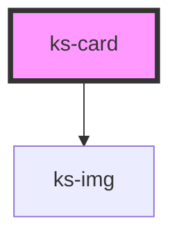

# ks-card

<!-- Auto Generated Below -->

## Properties

| Property       | Attribute       | Description | Type      | Default     |
| -------------- | --------------- | ----------- | --------- | ----------- |
| `alt`          | `alt`           |             | `string`  | `undefined` |
| `clickable`    | `clickable`     |             | `boolean` | `undefined` |
| `imgDirection` | `img-direction` |             | `string`  | `'top'`     |
| `imgSrc`       | `img-src`       |             | `string`  | `undefined` |
| `lazy`         | `lazy`          |             | `boolean` | `undefined` |
| `threshold`    | `threshold`     |             | `number`  | `undefined` |
| `url`          | `url`           |             | `string`  | `undefined` |

## Dependencies

### Depends on

- [ks-img](../image)

### Graph

----------------------------------------------

*Built with [StencilJS](https://stenciljs.com/)*
