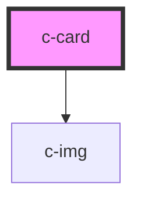

# c-card

<!-- Auto Generated Below -->

## Properties

| Property    | Attribute   | Description | Type      | Default     |
| ----------- | ----------- | ----------- | --------- | ----------- |
| `alt`       | `alt`       |             | `string`  | `undefined` |
| `cssClass`  | `css-class` |             | `string`  | `undefined` |
| `lazy`      | `lazy`      |             | `boolean` | `undefined` |
| `src`       | `src`       |             | `string`  | `undefined` |
| `threshold` | `threshold` |             | `number`  | `undefined` |

## Dependencies

### Depends on

- [c-img](../image)

### Graph

----------------------------------------------

*Built with [StencilJS](https://stenciljs.com/)*
