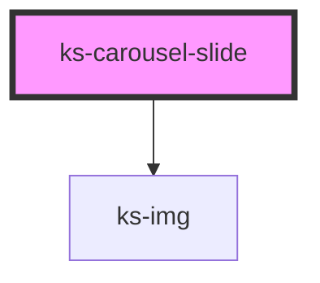

# ks-carousel

<!-- Auto Generated Below -->

## Properties

| Property      | Attribute      | Description | Type                            | Default     |
| ------------- | -------------- | ----------- | ------------------------------- | ----------- |
| `align`       | `align`        |             | `"center" \| "left" \| "right"` | `'center'`  |
| `alt`         | `alt`          |             | `string`                        | `undefined` |
| `fallbackSrc` | `fallback-src` |             | `string`                        | `undefined` |
| `href`        | `href`         |             | `string`                        | `undefined` |
| `hrefProp`    | `href-prop`    |             | `string`                        | `'href'`    |
| `imgHeight`   | `img-height`   |             | `number`                        | `undefined` |
| `imgWidth`    | `img-width`    |             | `number`                        | `undefined` |
| `lazy`        | `lazy`         |             | `boolean`                       | `false`     |
| `linkTag`     | `link-tag`     |             | `string`                        | `'a'`       |
| `position`    | `position`     |             | `"bottom" \| "center" \| "top"` | `'center'`  |
| `src`         | `src`          |             | `string`                        | `undefined` |
| `threshold`   | `threshold`    |             | `number`                        | `300`       |

## Dependencies

### Depends on

- [ks-img](../image)

### Graph

----------------------------------------------

*Built with [StencilJS](https://stenciljs.com/)*
