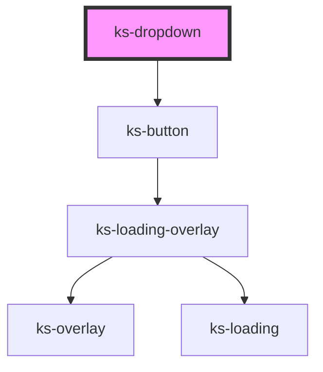

# ks-alert

<!-- Auto Generated Below -->

## Properties

| Property        | Attribute        | Description | Type                                                                                            | Default     |
| --------------- | ---------------- | ----------- | ----------------------------------------------------------------------------------------------- | ----------- |
| `color`         | `color`          |             | `"danger" \| "dark" \| "info" \| "light" \| "primary" \| "secondary" \| "success" \| "warning"` | `'primary'` |
| `display`       | `display`        |             | `"clear" \| "hollow" \| "link" \| "solid"`                                                      | `'solid'`   |
| `hideIndicator` | `hide-indicator` |             | `boolean`                                                                                       | `undefined` |
| `hideText`      | `hide-text`      |             | `boolean`                                                                                       | `undefined` |
| `icon`          | `icon`           |             | `string`                                                                                        | `undefined` |
| `megaMenu`      | `mega-menu`      |             | `boolean`                                                                                       | `undefined` |
| `position`      | `position`       |             | `"left" \| "right"`                                                                             | `'left'`    |
| `text`          | `text`           |             | `string`                                                                                        | `undefined` |

## Dependencies

### Depends on

- [ks-button](../button)

### Graph

----------------------------------------------

*Built with [StencilJS](https://stenciljs.com/)*
