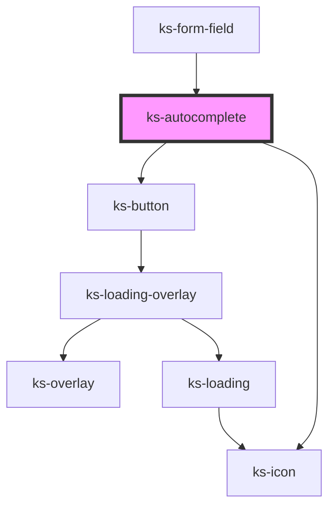

# ks-autocomplete

<!-- Auto Generated Below -->

## Properties

| Property     | Attribute     | Description | Type                                   | Default     |
| ------------ | ------------- | ----------- | -------------------------------------- | ----------- |
| `autoExpand` | `auto-expand` |             | `boolean`                              | `false`     |
| `debounce`   | `debounce`    |             | `number`                               | `0`         |
| `disabled`   | `disabled`    |             | `boolean`                              | `undefined` |
| `inputClass` | `input-class` |             | `string`                               | `undefined` |
| `inputId`    | `input-id`    |             | `string`                               | `undefined` |
| `name`       | `name`        |             | `string`                               | `undefined` |
| `required`   | `required`    |             | `boolean`                              | `undefined` |
| `size`       | `size`        |             | `"lg" \| "md" \| "sm"`                 | `'md'`      |
| `value`      | `value`       |             | `any[] \| boolean \| number \| string` | `''`        |

## Events

| Event     | Description | Type                          |
| --------- | ----------- | ----------------------------- |
| `changed` |             | `CustomEvent<IFormFieldData>` |
| `cleared` |             | `CustomEvent<any>`            |

## Methods

### `validate() => Promise<IFormFieldData>`

#### Returns

Type: `Promise<IFormFieldData>`

## Dependencies

### Used by

 - [ks-form-field](..)

### Depends on

- [ks-button](../../button)
- [ks-icon](../../icon)

### Graph

----------------------------------------------

*Built with [StencilJS](https://stenciljs.com/)*
