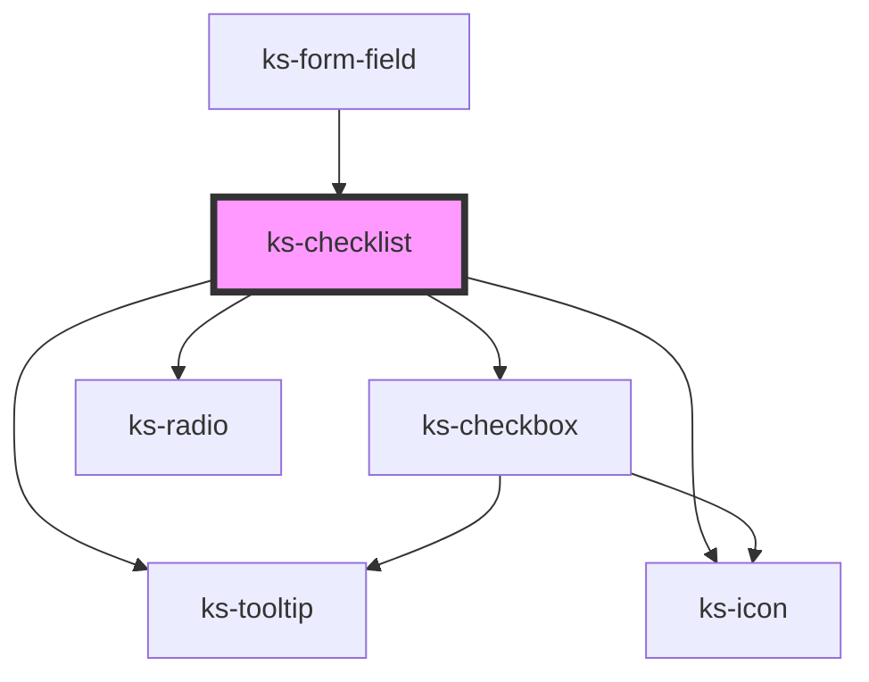

# ks-checklist

<!-- Auto Generated Below -->

## Properties

| Property               | Attribute                | Description | Type                    | Default                     |
| ---------------------- | ------------------------ | ----------- | ----------------------- | --------------------------- |
| `disabled`             | `disabled`               |             | `boolean`               | `false`                     |
| `helpText`             | `help-text`              |             | `string`                | `undefined`                 |
| `invalid`              | `invalid`                |             | `boolean`               | `false`                     |
| `label`                | `label`                  |             | `string`                | `undefined`                 |
| `name`                 | `name`                   |             | `string`                | `undefined`                 |
| `required`             | `required`               |             | `boolean`               | `undefined`                 |
| `requiredErrorMessage` | `required-error-message` |             | `string`                | ``This field is required.`` |
| `requiredText`         | `required-text`          |             | `string`                | `'Required'`                |
| `tooltipText`          | `tooltip-text`           |             | `string`                | `undefined`                 |
| `type`                 | `type`                   |             | `"checkbox" \| "radio"` | `'checkbox'`                |

## Events

| Event     | Description | Type                          |
| --------- | ----------- | ----------------------------- |
| `checked` |             | `CustomEvent<IFormFieldData>` |

## Methods

### `validate() => Promise<IFormFieldData>`

#### Returns

Type: `Promise<IFormFieldData>`

## Dependencies

### Used by

 - [ks-form-field](..)

### Depends on

- [ks-tooltip](../../tooltip)
- [ks-icon](../../icon)
- [ks-checkbox](../checkbox)
- [ks-radio](../radio)

### Graph

----------------------------------------------

*Built with [StencilJS](https://stenciljs.com/)*
