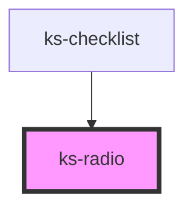

# ks-radio

<!-- Auto Generated Below -->

## Properties

| Property  | Attribute | Description | Type      | Default     |
| --------- | --------- | ----------- | --------- | ----------- |
| `checked` | `checked` |             | `boolean` | `undefined` |
| `inline`  | `inline`  |             | `boolean` | `false`     |
| `label`   | `label`   |             | `string`  | `undefined` |
| `name`    | `name`    |             | `string`  | `undefined` |

## Events

| Event      | Description | Type               |
| ---------- | ----------- | ------------------ |
| `selected` |             | `CustomEvent<any>` |

## Dependencies

### Used by

 - [ks-checklist](../checklist)

### Graph

----------------------------------------------

*Built with [StencilJS](https://stenciljs.com/)*
