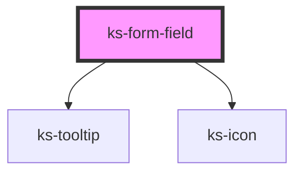

# ks-form-field

<!-- Auto Generated Below -->

## Properties

| Property       | Attribute       | Description | Type                                                                                              | Default      |
| -------------- | --------------- | ----------- | ------------------------------------------------------------------------------------------------- | ------------ |
| `autocomplete` | `autocomplete`  |             | `string`                                                                                          | `undefined`  |
| `disabled`     | `disabled`      |             | `boolean`                                                                                         | `undefined`  |
| `errorMessage` | `error-message` |             | `string`                                                                                          | `undefined`  |
| `helpText`     | `help-text`     |             | `string`                                                                                          | `undefined`  |
| `invalid`      | `invalid`       |             | `boolean`                                                                                         | `false`      |
| `label`        | `label`         |             | `string`                                                                                          | `undefined`  |
| `max`          | `max`           |             | `number`                                                                                          | `undefined`  |
| `maxlength`    | `maxlength`     |             | `number`                                                                                          | `undefined`  |
| `min`          | `min`           |             | `number`                                                                                          | `undefined`  |
| `minlength`    | `minlength`     |             | `number`                                                                                          | `undefined`  |
| `pattern`      | `pattern`       |             | `string`                                                                                          | `undefined`  |
| `placeholder`  | `placeholder`   |             | `string`                                                                                          | `undefined`  |
| `required`     | `required`      |             | `boolean`                                                                                         | `undefined`  |
| `requiredText` | `required-text` |             | `string`                                                                                          | `'Required'` |
| `step`         | `step`          |             | `number`                                                                                          | `undefined`  |
| `tooltipText`  | `tooltip-text`  |             | `string`                                                                                          | `undefined`  |
| `type`         | `type`          |             | `"date" \| "email" \| "hidden" \| "number" \| "password" \| "search" \| "tel" \| "text" \| "url"` | `'text'`     |
| `value`        | `value`         |             | `number \| string`                                                                                | `''`         |

## Events

| Event     | Description | Type               |
| --------- | ----------- | ------------------ |
| `updated` |             | `CustomEvent<any>` |

## Dependencies

### Depends on

- [ks-tooltip](../tooltip)
- [ks-icon](../icon)

### Graph

----------------------------------------------

*Built with [StencilJS](https://stenciljs.com/)*
