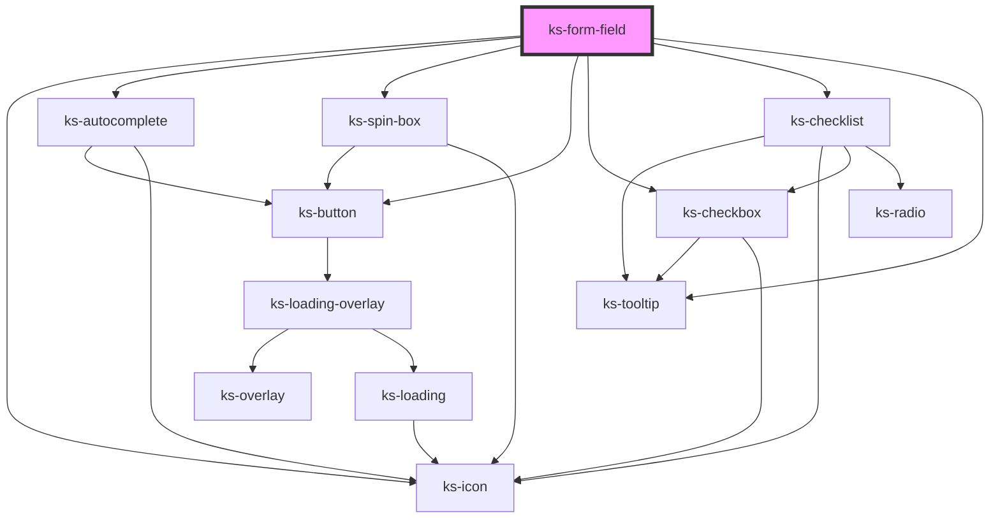

# ks-form-field

<!-- Auto Generated Below -->

## Properties

| Property                | Attribute                 | Description | Type                                                                                                                                                                                                                                               | Default                                                                                                               |
| ----------------------- | ------------------------- | ----------- | -------------------------------------------------------------------------------------------------------------------------------------------------------------------------------------------------------------------------------------------------- | --------------------------------------------------------------------------------------------------------------------- |
| `accept`                | `accept`                  |             | `string`                                                                                                                                                                                                                                           | `undefined`                                                                                                           |
| `autoExpand`            | `auto-expand`             |             | `boolean`                                                                                                                                                                                                                                          | `false`                                                                                                               |
| `autocomplete`          | `autocomplete`            |             | `string`                                                                                                                                                                                                                                           | `undefined`                                                                                                           |
| `badInputErrorMessage`  | `bad-input-error-message` |             | `string`                                                                                                                                                                                                                                           | `'There was a problem processing the value.'`                                                                         |
| `capture`               | `capture`                 |             | `"environment" \| "user"`                                                                                                                                                                                                                          | `undefined`                                                                                                           |
| `checked`               | `checked`                 |             | `boolean`                                                                                                                                                                                                                                          | `false`                                                                                                               |
| `datalist`              | `datalist`                |             | `boolean`                                                                                                                                                                                                                                          | `false`                                                                                                               |
| `debounce`              | `debounce`                |             | `number`                                                                                                                                                                                                                                           | `0`                                                                                                                   |
| `defaultErrorMessage`   | `default-error-message`   |             | `string`                                                                                                                                                                                                                                           | `'The value entered is not valid.'`                                                                                   |
| `disabled`              | `disabled`                |             | `boolean`                                                                                                                                                                                                                                          | `undefined`                                                                                                           |
| `helpText`              | `help-text`               |             | `string`                                                                                                                                                                                                                                           | `undefined`                                                                                                           |
| `hideLabel`             | `hide-label`              |             | `boolean`                                                                                                                                                                                                                                          | `false`                                                                                                               |
| `icon`                  | `icon`                    |             | `string`                                                                                                                                                                                                                                           | `undefined`                                                                                                           |
| `iconDirection`         | `icon-direction`          |             | `"left" \| "right"`                                                                                                                                                                                                                                | `'right'`                                                                                                             |
| `indeterminate`         | `indeterminate`           |             | `boolean`                                                                                                                                                                                                                                          | `false`                                                                                                               |
| `inline`                | `inline`                  |             | `boolean`                                                                                                                                                                                                                                          | `false`                                                                                                               |
| `inputClass`            | `input-class`             |             | `string`                                                                                                                                                                                                                                           | `undefined`                                                                                                           |
| `invalid`               | `invalid`                 |             | `boolean`                                                                                                                                                                                                                                          | `false`                                                                                                               |
| `label`                 | `label`                   |             | `string`                                                                                                                                                                                                                                           | `undefined`                                                                                                           |
| `max`                   | `max`                     |             | `number`                                                                                                                                                                                                                                           | `undefined`                                                                                                           |
| `maxErrorMessage`       | `max-error-message`       |             | `string`                                                                                                                                                                                                                                           | ``Your value must be less than ${this.max ? this.max + 1 : ''}.``                                                     |
| `maxlength`             | `maxlength`               |             | `number`                                                                                                                                                                                                                                           | `undefined`                                                                                                           |
| `maxlengthErrorMessage` | `maxlength-error-message` |             | `string`                                                                                                                                                                                                                                           | ``Your value must be no more than ${this.maxlength} characters.``                                                     |
| `min`                   | `min`                     |             | `number`                                                                                                                                                                                                                                           | `undefined`                                                                                                           |
| `minErrorMessage`       | `min-error-message`       |             | `string`                                                                                                                                                                                                                                           | ``Your value must be at least ${this.min}.``                                                                          |
| `minlength`             | `minlength`               |             | `number`                                                                                                                                                                                                                                           | `undefined`                                                                                                           |
| `minlengthErrorMessage` | `minlength-error-message` |             | `string`                                                                                                                                                                                                                                           | ``Your value must be at least ${this.minlength} characters.``                                                         |
| `multiple`              | `multiple`                |             | `boolean`                                                                                                                                                                                                                                          | `undefined`                                                                                                           |
| `name`                  | `name`                    |             | `string`                                                                                                                                                                                                                                           | `undefined`                                                                                                           |
| `pattern`               | `pattern`                 |             | `string`                                                                                                                                                                                                                                           | `undefined`                                                                                                           |
| `patternErrorMessage`   | `pattern-error-message`   |             | `string`                                                                                                                                                                                                                                           | `'The value was not in the right format.'`                                                                            |
| `placeholder`           | `placeholder`             |             | `string`                                                                                                                                                                                                                                           | `undefined`                                                                                                           |
| `required`              | `required`                |             | `boolean`                                                                                                                                                                                                                                          | `undefined`                                                                                                           |
| `requiredErrorMessage`  | `required-error-message`  |             | `string`                                                                                                                                                                                                                                           | `this.type === 'autocomplete' ? 'The value entered is not one of the available options.' : 'This field is required.'` |
| `requiredText`          | `required-text`           |             | `string`                                                                                                                                                                                                                                           | `'Required'`                                                                                                          |
| `size`                  | `size`                    |             | `"lg" \| "md" \| "sm"`                                                                                                                                                                                                                             | `'md'`                                                                                                                |
| `step`                  | `step`                    |             | `number`                                                                                                                                                                                                                                           | `1`                                                                                                                   |
| `stepErrorMessage`      | `step-error-message`      |             | `string`                                                                                                                                                                                                                                           | ``Your value must be an increment of ${this.step \|\| 1}.``                                                           |
| `tooltipLabel`          | `tooltip-label`           |             | `string`                                                                                                                                                                                                                                           | `'additional information'`                                                                                            |
| `tooltipSize`           | `tooltip-size`            |             | `"lg" \| "md" \| "sm" \| "xl"`                                                                                                                                                                                                                     | `'sm'`                                                                                                                |
| `tooltipText`           | `tooltip-text`            |             | `string`                                                                                                                                                                                                                                           | `undefined`                                                                                                           |
| `type`                  | `type`                    |             | `"autocomplete" \| "checkbox" \| "checklist" \| "color" \| "date" \| "email" \| "file" \| "hidden" \| "month" \| "number" \| "password" \| "radiolist" \| "range" \| "search" \| "select" \| "spin-box" \| "tel" \| "text" \| "textarea" \| "url"` | `'text'`                                                                                                              |
| `typeErrorMessage`      | `type-error-message`      |             | `string`                                                                                                                                                                                                                                           | ``Your value must be a valid ${this.type === 'tel' ? 'telephone number' : this.type}.``                               |
| `validateOnInput`       | `validate-on-input`       |             | `boolean`                                                                                                                                                                                                                                          | `false`                                                                                                               |
| `value`                 | `value`                   |             | `FileList \| any[] \| boolean \| number \| string`                                                                                                                                                                                                 | `undefined`                                                                                                           |
| `webkitdirectory`       | `webkitdirectory`         |             | `boolean`                                                                                                                                                                                                                                          | `undefined`                                                                                                           |

## Events

| Event     | Description | Type                          |
| --------- | ----------- | ----------------------------- |
| `blurred` |             | `CustomEvent<any>`            |
| `cleared` |             | `CustomEvent<any>`            |
| `updated` |             | `CustomEvent<IFormFieldData>` |

## Methods

### `validate() => Promise<IFormFieldData>`

#### Returns

Type: `Promise<IFormFieldData>`

## Dependencies

### Depends on

- [ks-icon](../icon)
- [ks-autocomplete](autocomplete)
- [ks-spin-box](spin-box)
- [ks-button](../button)
- [ks-checkbox](checkbox)
- [ks-checklist](checklist)
- [ks-tooltip](../tooltip)

### Graph

----------------------------------------------

*Built with [StencilJS](https://stenciljs.com/)*
