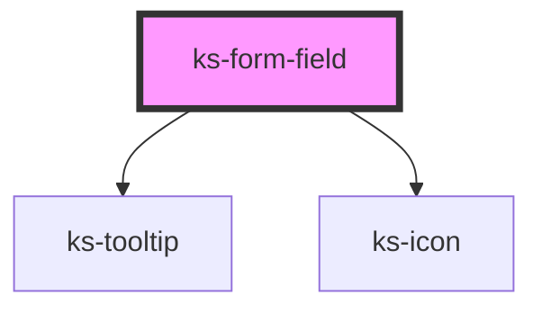

# ks-form-field

<!-- Auto Generated Below -->

## Properties

| Property                | Attribute                 | Description | Type                                                                                                                                      | Default                                                                                 |
| ----------------------- | ------------------------- | ----------- | ----------------------------------------------------------------------------------------------------------------------------------------- | --------------------------------------------------------------------------------------- |
| `autocomplete`          | `autocomplete`            |             | `string`                                                                                                                                  | `undefined`                                                                             |
| `badInputErrorMessage`  | `bad-input-error-message` |             | `string`                                                                                                                                  | `'There was a problem processing the value.'`                                           |
| `defaultErrorMessage`   | `default-error-message`   |             | `string`                                                                                                                                  | `'The value entered is not valid.'`                                                     |
| `disabled`              | `disabled`                |             | `boolean`                                                                                                                                 | `undefined`                                                                             |
| `helpText`              | `help-text`               |             | `string`                                                                                                                                  | `undefined`                                                                             |
| `invalid`               | `invalid`                 |             | `boolean`                                                                                                                                 | `false`                                                                                 |
| `label`                 | `label`                   |             | `string`                                                                                                                                  | `undefined`                                                                             |
| `max`                   | `max`                     |             | `number`                                                                                                                                  | `undefined`                                                                             |
| `maxErrorMessage`       | `max-error-message`       |             | `string`                                                                                                                                  | ``Your value must be no greater than ${this.max}.``                                     |
| `maxlength`             | `maxlength`               |             | `number`                                                                                                                                  | `undefined`                                                                             |
| `maxlengthErrorMessage` | `maxlength-error-message` |             | `string`                                                                                                                                  | ``Your value must be no more than ${this.maxlength} characters.``                       |
| `min`                   | `min`                     |             | `number`                                                                                                                                  | `undefined`                                                                             |
| `minErrorMessage`       | `min-error-message`       |             | `string`                                                                                                                                  | ``Your value must be no less than ${this.min}.``                                        |
| `minlength`             | `minlength`               |             | `number`                                                                                                                                  | `undefined`                                                                             |
| `minlengthErrorMessage` | `minlength-error-message` |             | `string`                                                                                                                                  | ``Your value must be at least ${this.minlength} characters.``                           |
| `pattern`               | `pattern`                 |             | `string`                                                                                                                                  | `undefined`                                                                             |
| `patternErrorMessage`   | `pattern-error-message`   |             | `string`                                                                                                                                  | `'There was a problem processing the value.'`                                           |
| `placeholder`           | `placeholder`             |             | `string`                                                                                                                                  | `undefined`                                                                             |
| `required`              | `required`                |             | `boolean`                                                                                                                                 | `undefined`                                                                             |
| `requiredErrorMessage`  | `required-error-message`  |             | `string`                                                                                                                                  | ``This field is required.``                                                             |
| `requiredText`          | `required-text`           |             | `string`                                                                                                                                  | `'Required'`                                                                            |
| `step`                  | `step`                    |             | `number`                                                                                                                                  | `undefined`                                                                             |
| `stepErrorMessage`      | `step-error-message`      |             | `string`                                                                                                                                  | ``Your value must be divisible by ${this.step}.``                                       |
| `tooltipText`           | `tooltip-text`            |             | `string`                                                                                                                                  | `undefined`                                                                             |
| `type`                  | `type`                    |             | `"datalist" \| "date" \| "email" \| "hidden" \| "number" \| "password" \| "search" \| "select" \| "tel" \| "text" \| "textarea" \| "url"` | `'text'`                                                                                |
| `typeErrorMessage`      | `type-error-message`      |             | `string`                                                                                                                                  | ``Your value must be a valid ${this.type === 'tel' ? 'telephone number' : this.type}.`` |
| `value`                 | `value`                   |             | `number \| string`                                                                                                                        | `''`                                                                                    |

## Events

| Event     | Description | Type                                                                 |
| --------- | ----------- | -------------------------------------------------------------------- |
| `updated` |             | `CustomEvent<{ validity: ValidityState; value: string \| number; }>` |

## Dependencies

### Depends on

- [ks-tooltip](../tooltip)
- [ks-icon](../icon)

### Graph

----------------------------------------------

*Built with [StencilJS](https://stenciljs.com/)*
