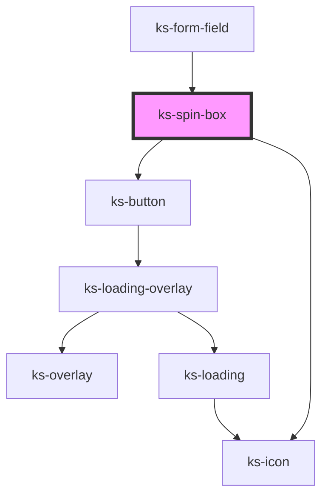

# ks-overlay

<!-- Auto Generated Below -->

## Properties

| Property   | Attribute  | Description | Type                                   | Default     |
| ---------- | ---------- | ----------- | -------------------------------------- | ----------- |
| `disabled` | `disabled` |             | `boolean`                              | `false`     |
| `inputId`  | `input-id` |             | `string`                               | `undefined` |
| `invalid`  | `invalid`  |             | `boolean`                              | `false`     |
| `max`      | `max`      |             | `number`                               | `undefined` |
| `min`      | `min`      |             | `number`                               | `0`         |
| `name`     | `name`     |             | `string`                               | `undefined` |
| `required` | `required` |             | `boolean`                              | `false`     |
| `step`     | `step`     |             | `number`                               | `1`         |
| `value`    | `value`    |             | `any[] \| boolean \| number \| string` | `0`         |

## Events

| Event     | Description | Type               |
| --------- | ----------- | ------------------ |
| `updated` |             | `CustomEvent<any>` |

## Methods

### `validate() => Promise<IFormFieldData>`

#### Returns

Type: `Promise<IFormFieldData>`

## Dependencies

### Used by

 - [ks-form-field](..)

### Depends on

- [ks-button](../../button)
- [ks-icon](../../icon)

### Graph

----------------------------------------------

*Built with [StencilJS](https://stenciljs.com/)*
