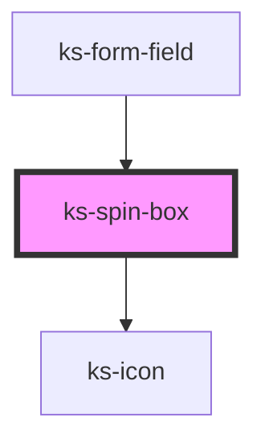

# ks-overlay

<!-- Auto Generated Below -->

## Properties

| Property     | Attribute     | Description | Type                                               | Default     |
| ------------ | ------------- | ----------- | -------------------------------------------------- | ----------- |
| `disabled`   | `disabled`    |             | `boolean`                                          | `false`     |
| `inputClass` | `input-class` |             | `string`                                           | `undefined` |
| `inputId`    | `input-id`    |             | `string`                                           | `undefined` |
| `invalid`    | `invalid`     |             | `boolean`                                          | `false`     |
| `max`        | `max`         |             | `number`                                           | `undefined` |
| `min`        | `min`         |             | `number`                                           | `undefined` |
| `name`       | `name`        |             | `string`                                           | `undefined` |
| `required`   | `required`    |             | `boolean`                                          | `false`     |
| `size`       | `size`        |             | `"lg" \| "md" \| "sm"`                             | `'md'`      |
| `step`       | `step`        |             | `number`                                           | `1`         |
| `value`      | `value`       |             | `FileList \| any[] \| boolean \| number \| string` | `0`         |

## Events

| Event     | Description | Type               |
| --------- | ----------- | ------------------ |
| `updated` |             | `CustomEvent<any>` |

## Methods

### `validate() => Promise<IFormFieldData>`

#### Returns

Type: `Promise<IFormFieldData>`

## Dependencies

### Used by

 - [ks-form-field](..)

### Depends on

- [ks-icon](../../icon)

### Graph

----------------------------------------------

*Built with [StencilJS](https://stenciljs.com/)*
