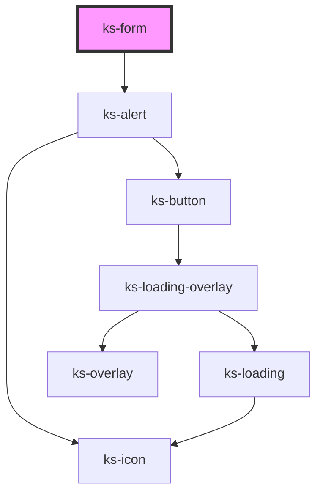

# ks-icon

<!-- Auto Generated Below -->

## Properties

| Property       | Attribute       | Description | Type                                                                           | Default                                                                                  |
| -------------- | --------------- | ----------- | ------------------------------------------------------------------------------ | ---------------------------------------------------------------------------------------- |
| `action`       | `action`        |             | `string`                                                                       | `undefined`                                                                              |
| `enctype`      | `enctype`       |             | `"application/x-www-form-urlencoded" \| "multipart/form-data" \| "text/plain"` | `undefined`                                                                              |
| `errorMessage` | `error-message` |             | `string`                                                                       | `'One or more of the from fields are not valid. Please, review the form and try again.'` |
| `formClass`    | `form-class`    |             | `string`                                                                       | `undefined`                                                                              |
| `inline`       | `inline`        |             | `boolean`                                                                      | `false`                                                                                  |
| `invalid`      | `invalid`       |             | `boolean`                                                                      | `false`                                                                                  |
| `method`       | `method`        |             | `"get" \| "post"`                                                              | `undefined`                                                                              |
| `target`       | `target`        |             | `"_blank" \| "_parent" \| "_self" \| "_top"`                                   | `undefined`                                                                              |

## Events

| Event       | Description | Type                     |
| ----------- | ----------- | ------------------------ |
| `cleared`   |             | `CustomEvent<any>`       |
| `submitted` |             | `CustomEvent<IFormData>` |

## Methods

### `clear() => Promise<void>`

#### Returns

Type: `Promise<void>`

## Dependencies

### Depends on

- [ks-alert](../alert)

### Graph

----------------------------------------------

*Built with [StencilJS](https://stenciljs.com/)*
