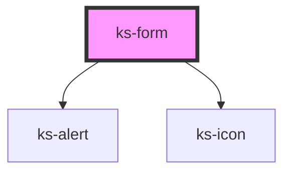

# ks-icon

<!-- Auto Generated Below -->

## Properties

| Property       | Attribute       | Description | Type                                         | Default                                                                                  |
| -------------- | --------------- | ----------- | -------------------------------------------- | ---------------------------------------------------------------------------------------- |
| `action`       | `action`        |             | `string`                                     | `undefined`                                                                              |
| `errorMessage` | `error-message` |             | `string`                                     | `'One or more of the from fields are not valid. Please, review the form and try again.'` |
| `invalid`      | `invalid`       |             | `boolean`                                    | `false`                                                                                  |
| `method`       | `method`        |             | `"get" \| "post"`                            | `undefined`                                                                              |
| `target`       | `target`        |             | `"_blank" \| "_parent" \| "_self" \| "_top"` | `undefined`                                                                              |

## Events

| Event       | Description | Type                     |
| ----------- | ----------- | ------------------------ |
| `submitted` |             | `CustomEvent<IFormData>` |

## Dependencies

### Depends on

- [ks-alert](../alert)
- [ks-icon](../icon)

### Graph

----------------------------------------------

*Built with [StencilJS](https://stenciljs.com/)*
