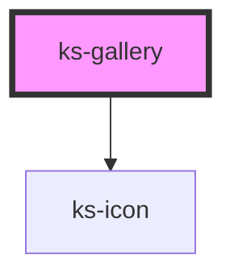

# ks-switch

<!-- Auto Generated Below -->

## Properties

| Property         | Attribute          | Description | Type     | Default          |
| ---------------- | ------------------ | ----------- | -------- | ---------------- |
| `heading`        | `heading`          |             | `string` | `undefined`      |
| `href`           | `href`             |             | `string` | `undefined`      |
| `hrefProp`       | `href-prop`        |             | `string` | `'href'`         |
| `itemWidth`      | `item-width`       |             | `string` | `undefined`      |
| `linkTag`        | `link-tag`         |             | `string` | `'a'`            |
| `linkText`       | `link-text`        |             | `string` | `undefined`      |
| `nextButtonText` | `next-button-text` |             | `string` | `'scroll right'` |
| `prevButtonText` | `prev-button-text` |             | `string` | `'scroll left'`  |

## Dependencies

### Depends on

- [ks-icon](../icon)

### Graph

----------------------------------------------

*Built with [StencilJS](https://stenciljs.com/)*
