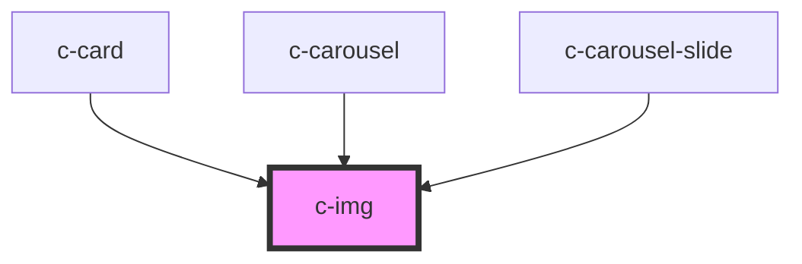

# c-img

<!-- Auto Generated Below -->

## Properties

| Property    | Attribute   | Description | Type      | Default     |
| ----------- | ----------- | ----------- | --------- | ----------- |
| `alt`       | `alt`       |             | `string`  | `undefined` |
| `cssClass`  | `css-class` |             | `string`  | `''`        |
| `lazy`      | `lazy`      |             | `boolean` | `undefined` |
| `src`       | `src`       |             | `string`  | `undefined` |
| `threshold` | `threshold` |             | `number`  | `300`       |

## Dependencies

### Used by

 - [c-card](../card)
 - [c-carousel](../carousel)
 - [c-carousel-slide](../carousel)

### Graph

----------------------------------------------

*Built with [StencilJS](https://stenciljs.com/)*
