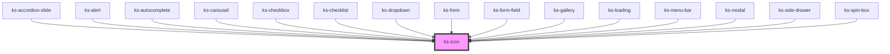

# ks-icon

<!-- Auto Generated Below -->

## Properties

| Property     | Attribute     | Description | Type     | Default     |
| ------------ | ------------- | ----------- | -------- | ----------- |
| `icon`       | `icon`        |             | `string` | `undefined` |
| `label`      | `label`       |             | `string` | `undefined` |
| `labelledBy` | `labelled-by` |             | `string` | `undefined` |

## Dependencies

### Used by

 - [ks-accordion-slide](../accordion)
 - [ks-alert](../alert)
 - [ks-autocomplete](../form-field/autocomplete)
 - [ks-carousel](../carousel)
 - [ks-checkbox](../form-field/checkbox)
 - [ks-checklist](../form-field/checklist)
 - [ks-dropdown](../dropdown)
 - [ks-form](../form)
 - [ks-form-field](../form-field)
 - [ks-gallery](../gallery)
 - [ks-loading](../loading)
 - [ks-menu-bar](../menu-bar)
 - [ks-modal](../modal)
 - [ks-side-drawer](../side-drawer)
 - [ks-spin-box](../form-field/spin-box)

### Graph

----------------------------------------------

*Built with [StencilJS](https://stenciljs.com/)*
