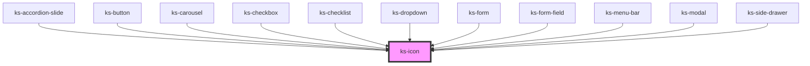

# ks-icon

<!-- Auto Generated Below -->

## Properties

| Property | Attribute | Description | Type                                                                                                                                   | Default     |
| -------- | --------- | ----------- | -------------------------------------------------------------------------------------------------------------------------------------- | ----------- |
| `icon`   | `icon`    |             | `string`                                                                                                                               | `undefined` |
| `rotate` | `rotate`  |             | `"-135" \| "-180" \| "-225" \| "-270" \| "-360" \| "-45" \| "-90" \| "0" \| "135" \| "180" \| "225" \| "270" \| "360" \| "45" \| "90"` | `'0'`       |

## Dependencies

### Used by

 - [ks-accordion-slide](../accordion)
 - [ks-button](../button)
 - [ks-carousel](../carousel)
 - [ks-checkbox](../form-field)
 - [ks-checklist](../form-field)
 - [ks-dropdown](../dropdown)
 - [ks-form](../form)
 - [ks-form-field](../form-field)
 - [ks-menu-bar](../menu-bar)
 - [ks-modal](../modal)
 - [ks-side-drawer](../side-drawer)

### Graph

----------------------------------------------

*Built with [StencilJS](https://stenciljs.com/)*
