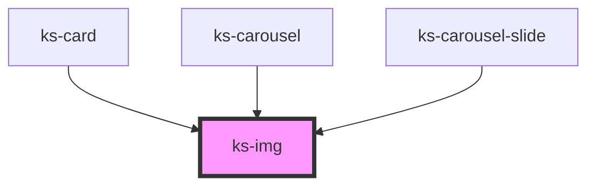

# ks-img

<!-- Auto Generated Below -->

## Properties

| Property      | Attribute      | Description | Type      | Default     |
| ------------- | -------------- | ----------- | --------- | ----------- |
| `alt`         | `alt`          |             | `string`  | `undefined` |
| `aspectRatio` | `aspect-ratio` |             | `string`  | `undefined` |
| `height`      | `height`       |             | `number`  | `undefined` |
| `lazy`        | `lazy`         |             | `boolean` | `undefined` |
| `src`         | `src`          |             | `string`  | `undefined` |
| `threshold`   | `threshold`    |             | `number`  | `300`       |
| `width`       | `width`        |             | `number`  | `undefined` |

## Dependencies

### Used by

 - [ks-card](../card)
 - [ks-carousel](../carousel)
 - [ks-carousel-slide](../carousel)

### Graph

----------------------------------------------

*Built with [StencilJS](https://stenciljs.com/)*
