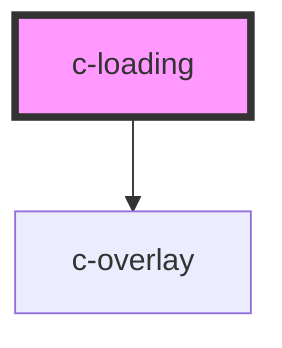

# c-overlay

<!-- Auto Generated Below -->

## Properties

| Property   | Attribute  | Description | Type                      | Default     |
| ---------- | ---------- | ----------- | ------------------------- | ----------- |
| `absolute` | `absolute` |             | `boolean`                 | `false`     |
| `type`     | `type`     |             | `"ellipsis" \| "spinner"` | `'spinner'` |

## Methods

### `hide() => Promise<void>`

#### Returns

Type: `Promise<void>`

### `show() => Promise<void>`

#### Returns

Type: `Promise<void>`

## Dependencies

### Depends on

- [c-overlay](../overlay)

### Graph

----------------------------------------------

*Built with [StencilJS](https://stenciljs.com/)*
