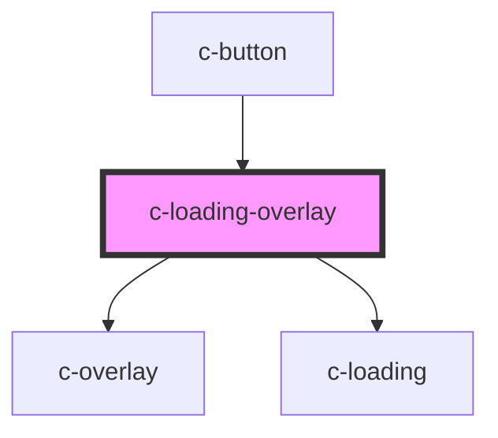

# c-overlay

<!-- Auto Generated Below -->

## Properties

| Property      | Attribute      | Description | Type                                                     | Default        |
| ------------- | -------------- | ----------- | -------------------------------------------------------- | -------------- |
| `absolute`    | `absolute`     |             | `boolean`                                                | `false`        |
| `message`     | `message`      |             | `string`                                                 | `'Loading...'` |
| `showMessage` | `show-message` |             | `boolean`                                                | `undefined`    |
| `size`        | `size`         |             | `"lg" \| "md" \| "sm" \| "xl" \| "xs" \| "xxl" \| "xxs"` | `'sm'`         |

## Methods

### `hide() => Promise<void>`

#### Returns

Type: `Promise<void>`

### `show() => Promise<void>`

#### Returns

Type: `Promise<void>`

## Dependencies

### Used by

 - [c-button](../button)

### Depends on

- [c-overlay](../overlay)
- [c-loading]()

### Graph

----------------------------------------------

*Built with [StencilJS](https://stenciljs.com/)*
