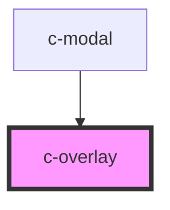

# c-overlay

<!-- Auto Generated Below -->

## Properties

| Property      | Attribute     | Description | Type                | Default     |
| ------------- | ------------- | ----------- | ------------------- | ----------- |
| `absolute`    | `absolute`    |             | `boolean`           | `undefined` |
| `dismissible` | `dismissible` |             | `boolean`           | `true`      |
| `theme`       | `theme`       |             | `"dark" \| "light"` | `'dark'`    |
| `titleId`     | `title-id`    |             | `string`            | `undefined` |

## Methods

### `hide() => Promise<void>`

#### Returns

Type: `Promise<void>`

### `show() => Promise<void>`

#### Returns

Type: `Promise<void>`

## Dependencies

### Used by

 - [c-modal](../modal)

### Graph

----------------------------------------------

*Built with [StencilJS](https://stenciljs.com/)*
