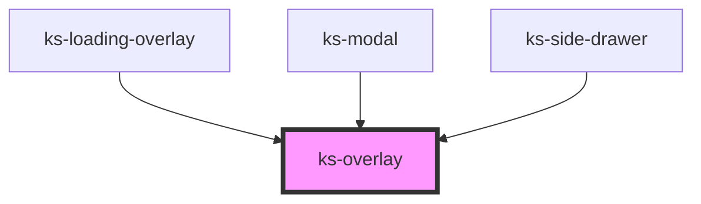

# ks-overlay

<!-- Auto Generated Below -->

## Properties

| Property       | Attribute       | Description | Type                | Default     |
| -------------- | --------------- | ----------- | ------------------- | ----------- |
| `absolute`     | `absolute`      |             | `boolean`           | `undefined` |
| `preventClose` | `prevent-close` |             | `boolean`           | `false`     |
| `theme`        | `theme`         |             | `"dark" \| "light"` | `'dark'`    |
| `titleId`      | `title-id`      |             | `string`            | `undefined` |

## Methods

### `hide() => Promise<void>`

#### Returns

Type: `Promise<void>`

### `show() => Promise<void>`

#### Returns

Type: `Promise<void>`

## Dependencies

### Used by

 - [ks-loading-overlay](../loading)
 - [ks-modal](../modal)
 - [ks-side-drawer](../side-drawer)

### Graph

----------------------------------------------

*Built with [StencilJS](https://stenciljs.com/)*
