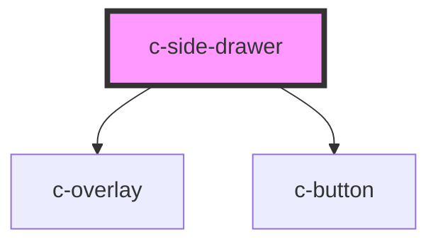

# c-button

<!-- Auto Generated Below -->

## Properties

| Property     | Attribute     | Description | Type                | Default     |
| ------------ | ------------- | ----------- | ------------------- | ----------- |
| `headerText` | `header-text` |             | `string`            | `undefined` |
| `name`       | `name`        |             | `string`            | `undefined` |
| `position`   | `position`    |             | `"left" \| "right"` | `'left'`    |

## Methods

### `hide() => Promise<void>`

#### Returns

Type: `Promise<void>`

### `show() => Promise<void>`

#### Returns

Type: `Promise<void>`

## Dependencies

### Depends on

- [c-overlay](../overlay)
- [c-button](../button)

### Graph

----------------------------------------------

*Built with [StencilJS](https://stenciljs.com/)*
