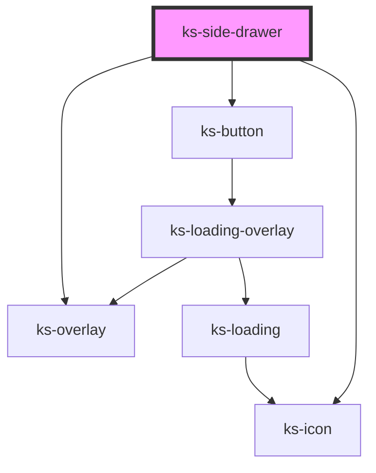

# ks-button

<!-- Auto Generated Below -->

## Properties

| Property     | Attribute     | Description | Type                           | Default     |
| ------------ | ------------- | ----------- | ------------------------------ | ----------- |
| `headerText` | `header-text` |             | `string`                       | `undefined` |
| `position`   | `position`    |             | `"left" \| "right"`            | `'left'`    |
| `size`       | `size`        |             | `"lg" \| "md" \| "sm" \| "xl"` | `'sm'`      |

## Events

| Event    | Description | Type               |
| -------- | ----------- | ------------------ |
| `hidden` |             | `CustomEvent<any>` |
| `shown`  |             | `CustomEvent<any>` |

## Methods

### `hide() => Promise<void>`

#### Returns

Type: `Promise<void>`

### `show() => Promise<void>`

#### Returns

Type: `Promise<void>`

## Dependencies

### Depends on

- [ks-overlay](../overlay)
- [ks-button](../button)
- [ks-icon](../icon)

### Graph

----------------------------------------------

*Built with [StencilJS](https://stenciljs.com/)*
