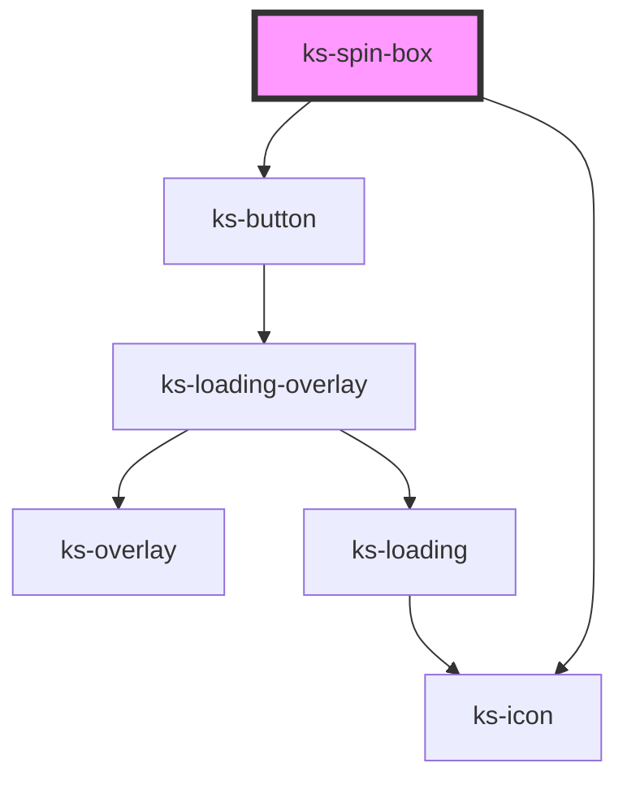

# ks-overlay

<!-- Auto Generated Below -->

## Properties

| Property    | Attribute     | Description | Type     | Default     |
| ----------- | ------------- | ----------- | -------- | ----------- |
| `labelId`   | `label-id`    |             | `string` | `undefined` |
| `max`       | `max`         |             | `number` | `undefined` |
| `min`       | `min`         |             | `number` | `0`         |
| `spinBoxId` | `spin-box-id` |             | `string` | `undefined` |
| `step`      | `step`        |             | `number` | `1`         |
| `value`     | `value`       |             | `number` | `0`         |

## Events

| Event     | Description | Type               |
| --------- | ----------- | ------------------ |
| `updated` |             | `CustomEvent<any>` |

## Dependencies

### Depends on

- [ks-button](../button)
- [ks-icon](../icon)

### Graph

----------------------------------------------

*Built with [StencilJS](https://stenciljs.com/)*
