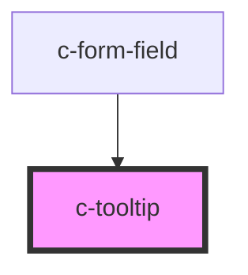

# c-alert

<!-- Auto Generated Below -->

## Properties

| Property         | Attribute         | Description | Type                                     | Default     |
| ---------------- | ----------------- | ----------- | ---------------------------------------- | ----------- |
| `disable`        | `disable`         |             | `boolean`                                | `undefined` |
| `hideDecoration` | `hide-decoration` |             | `boolean`                                | `undefined` |
| `position`       | `position`        |             | `"bottom" \| "left" \| "right" \| "top"` | `'top'`     |
| `show`           | `show`            |             | `boolean`                                | `undefined` |
| `size`           | `size`            |             | `"lg" \| "md" \| "sm" \| "xl"`           | `'sm'`      |
| `text`           | `text`            |             | `string`                                 | `undefined` |

## Dependencies

### Used by

 - [c-form-field](../form-field)

### Graph

----------------------------------------------

*Built with [StencilJS](https://stenciljs.com/)*
